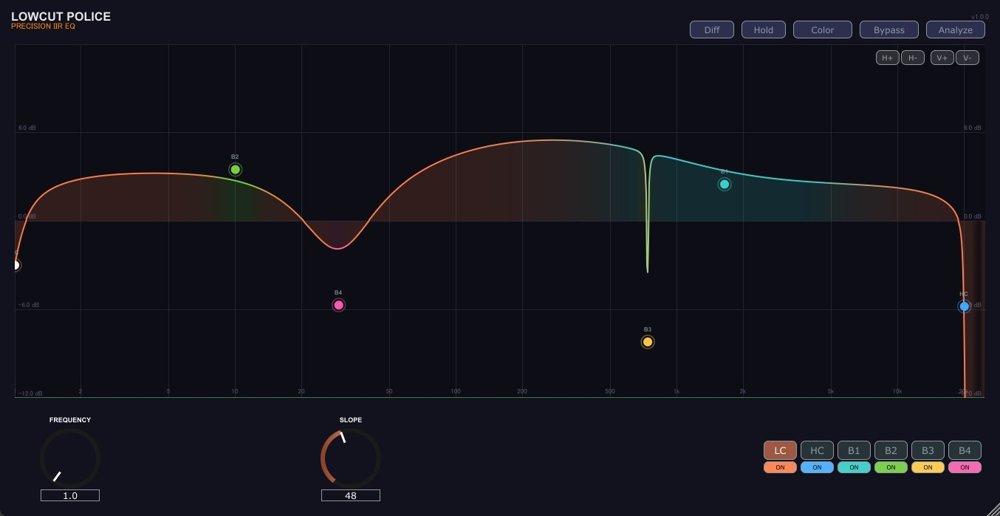
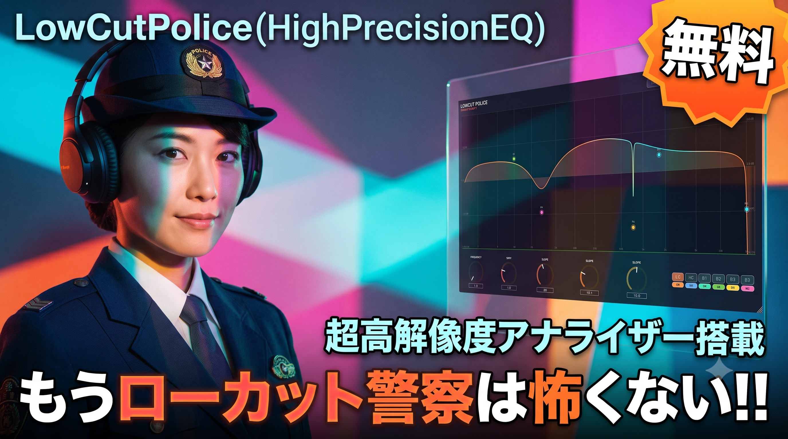

# LowCutPolice（HighPrecisionEQ）

##

## Demo Videos

## Demo Videos

  <b>Introduction　YoutubeLink</b> 
  

## Overview
**LowCutPolice** is a high-performance, professional audio plugin designed to clean up muddy low-end frequencies with absolute precision. It combines a zero-latency minimum-phase IIR filter engine with an ultra-high-resolution analyzer that can display all the way down to **1 Hz** — making the invisible low end visible so you can treat it accurately.

LowCut Police is not a generic, all-purpose equalizer. Instead, it is a highly specialized, practical, and razor-sharp professional tool engineered to achieve one single goal: **detecting and eradicating muddy low-end resonances ("Mud") to make the foundation of your mix completely clean.**

> [!NOTE]
> **Zero Latency**: All filters are minimum-phase IIR designs with a processing latency of **0 samples**. No Plugin Delay Compensation (PDC) is required, and the plugin is fully safe to use while tracking, monitoring, or performing live — as well as in mixing and mastering.

> [!WARNING]
> **AVX2 Required**: The DSP engine is optimized with AVX2 SIMD instructions. A CPU supporting AVX2 (Intel Haswell 2013+ / AMD Excavator+) is required.

---
## Key Features
### ⚡ Zero-Latency Minimum-Phase Engine
- **No Pre-Echo, No Delay**: Unlike linear-phase EQs, minimum-phase processing produces no pre-ringing — kick and transient attacks stay perfectly clean — and adds zero latency.
- **Click-Free Automation**: All parameters are continuously smoothed (~15 ms), and filter structure changes (slope/enable) are crossfaded with a raised-cosine window (~10 ms). No zipper noise or clicks, verified by measurement.
- **What You Set Is What You Get**: The displayed curve matches the actual processing within 0.01 dB. No hidden band-interaction "correction" — adjacent bands sum naturally, exactly like classic professional EQs.
- **Reduced Ringing**: The cut filters use Butterworth cascades (TPT SVF) with a hybrid Q arrangement that suppresses post-ringing at steep slope settings.

### 🔬 1 Hz High-Resolution Analyzer (Non-FFT)
- **800-Band Analog-Style Filter Bank**: No FFT involved. The sub region from **1 Hz to 60 Hz is analyzed in 0.2 Hz steps** (296 bands) — far beyond the ~10.8 Hz bin resolution of a typical 4096-point FFT analyzer.
- **Alias-Free Decimation**: Each multirate stage is preceded by an 8th-order Butterworth anti-aliasing filter (alias rejection better than -110 dB), so mid-band content never appears as false sub-bass spectrum.
- **Calibrated Display**: A 0 dBFS sine reads 0 dB, within ±0.25 dB across the entire range.
- **Peak Hold**: Capture momentary low-end peaks and resonances over a full song pass with the **Hold** button.
- **Deep Zoom**: Zoom the frequency axis down to 1 Hz (H+/H− buttons or Ctrl+wheel). Pan left/right by dragging or scrolling on empty space. Below 60 Hz, point dragging snaps to a 0.2 Hz grid for precise sub-bass work.

#### Why a Filter Bank Instead of FFT?

A standard FFT analyzer and this plugin's filter-bank analyzer solve the spectrum differently. Each has trade-offs:

| | FFT Analyzer | This Plugin (SVF Filter Bank) |
| :--- | :--- | :--- |
| **Strengths** | Very light on CPU (`O(N log N)`); a single transform yields the whole spectrum. Well understood and ubiquitous. | Resolution is set per band, so the sub region gets **0.2 Hz steps down to 1 Hz**. Log/perceptual band spacing. No windowing, so no spectral leakage. Per-band analog-style ballistics (attack/release). Calibrated (0 dBFS sine = 0 dB). |
| **Weaknesses** | Frequency resolution is fixed by bin width (≈10.8 Hz at 4096 pts / 44.1 kHz), so the low end has only a handful of bins — sub-bass is effectively invisible. Linear bins waste resolution up high. Windowing causes spectral leakage, and larger transforms increase time smearing/latency. | Heavier on CPU (hundreds of filters running continuously). Very low bands are inherently **slow to settle** — resolving 1 Hz takes time (a fundamental uncertainty-principle limit, not a bug). More complex to implement and tune. |

In short: FFT is the efficient general-purpose choice, but its fixed bin width makes it poor at the very low frequencies this plugin is built to treat. The filter bank trades CPU for the sub-bass resolution and log-scaled, leakage-free readout that low-end surgery actually needs.

### 🎛️ Surgical Equalization & Shaping
- **High-Pass Filter (LowCut)**: Cutoff frequency from 1 Hz to 500 Hz (logarithmic scale) with slope selections of 12, 24, 36, 48, 60, 72, 84, and 96 dB/oct.
- **Low-Pass Filter (HighCut)**: Cutoff frequency from 1 Hz to 25,000 Hz with the same 12–96 dB/oct slope selections.
- **4-Band Bell EQ**: Independent minimum-phase parametric equalizers (10 Hz to 25,000 Hz) with gain (±12 dB) and Q (0.3 to 120) controls for surgical notch filtering or subtle tone correction. Orfanidis (Nyquist-matched) design — the curve does not cramp near Nyquist.
- **Accurate Curve Rendering**: The response curve is drawn with 4× supersampling plus exact band-center evaluation, so even a Q=120 notch is displayed at its full depth at any zoom level.

### 🎨 10 Dynamic Color Themes (Palette Switcher)
Click the **Color** button in the header to cycle through 10 carefully curated visual themes. The theme changes the background, grid, curves, analyzer gradient, and knobs instantly:
1. **Studio Neon**: Cyber-studio theme (Default).
2. **Chic Mono**: Elegant monochrome.
3. **Vivid Future**: Vibrant neon colors.
4. **Warm Retro**: Vintage brown and orange tones.
5. **Pastel Dream**: Soft pastel gradients.
6. **Cyberpunk**: High-contrast cyberpunk yellow and pink.
7. **Ocean Abyss**: Deep sea blue-greens.
8. **Forest Zenith**: Calm forest greens.
9. **Sunset Glow**: Warm sunset gradient.
10. **Midnight Gold**: Luxury gold-on-black.

### 🎧 Precision Monitoring Tools
- **Listen Diff**: Outputs the difference signal ($Dry - Wet$). Listen only to what the plugin is removing/boosting — sample-accurate thanks to zero latency.
- **Solo-Sweep (Shift + Click/Drag)**: Shift-drag any EQ point to temporarily apply a narrow bandpass solo filter around the target band.
- **Interactive Graphs**: Drag EQ points directly on the screen. Auto-switching knobs update to match the selected band. Hovering — or dragging a point — shows the frequency and musical note name in real time (e.g. `55.0 Hz / A1`).
- **Display Modes**: Cycle the **Analyze** button through EQ curve + analyzer / waveform (Dry–Wet) / phase response views.

### 🛡️ Realtime-Safe Engineering (Zero Runtime Allocation)
- **100% Heap-Allocation-Free Audio Path**: Guaranteed zero heap allocations (`new` or `malloc`) in the audio processing block (`processBlock`) and the background analyzer thread. No memory fragmentation under heavy multitrack loads.
- **Lock-Free Parameter Handoff**: The audio thread never waits on a lock — parameter updates are handed off via try-lock and applied between blocks.
- **Stability Guards**: NaN-prevention circuitry keeps the plugin stable even at extreme Q settings. Processing auto-suspends after 1.5 s of silence to save CPU.
- **Double Precision + AVX2 SIMD**: 64-bit internal processing with both stereo channels computed simultaneously.
- **VBlank Sync**: Visual updates are synchronized to the host screen refresh rate using JUCE 8 VBlank, conserving CPU cycles when the plugin window is closed or idle.

---
## System Requirements
- **OS**: Windows 10 / Windows 11 (64-bit only) - **Exclusively for Windows**
- **CPU**: **AVX2 support required** (Intel Haswell 2013+ / AMD Excavator+)
- **Format**: VST3
- **Latency**: 0 samples (no PDC required)
- **Supported Host**: **Ableton Live 11+ only (fully tested and verified)**. Other VST3 hosts may work but are not tested or supported.
---
## Disclaimer (Ear & Speaker Protection)
**IMPORTANT WARNING**: This plugin contains specialized audio features such as "Listen Diff" and "Solo-Sweep". Rapidly sweeping frequencies or adjusting extreme Q values can produce abrupt transients and volume changes. To protect your hearing, ears, speakers, and studio monitors, always ensure you keep your master monitoring volume at a safe level. The developers accept no liability for any damage to equipment or physical injury resulting from the use of this software. Use it at your own risk.
---
## Installation
1. Download the latest `HighPrecisionEQ.vst3` from the [Releases](https://github.com/OTODESK4193/HighPrecisionEQ/releases/latest) page.
2. Move the compiled `HighPrecisionEQ.vst3` file to your system VST3 plugin folder:
   `C:\Program Files\Common Files\VST3`
3. Rescan plugins in your DAW.
---
## 📚 Documentation
Comprehensive user manuals with full technical breakdowns and shortcuts are available in this repository:
- 📖 [Japanese Manual (日本語マニュアル)](Source/Assets/MANUAL_JP.md)
- 📖 [English Manual (English Manual)](Source/Assets/MANUAL_EN.md)
---
## Shortcuts Summary
| Shortcut | Action |
| :--- | :--- |
| **Mousewheel on EQ Point** | Directly adjust **Q-factor** (Bell bands) or **Slope** (LowCut / HighCut) |
| **Double-Click EQ Point** | Toggle the band **on/off**. Disabled points stay visible as dimmed "ghost" markers, so you can double-click again to turn them back on |
| **Shift + Click / Drag** | Activate **Solo-Sweep** (bandpass solo monitor) |
| **Ctrl + Mousewheel** | Zoom in/out on the frequency axis, centered on the cursor (down to 1 Hz) |
| **Mousewheel on Empty Space** | Move the EQ curve (view) **left/right** — follows the cursor at any zoom level |
| **Left/Right Drag on Empty Space** | Move the EQ curve (view) **left/right only** (no vertical action) |
| **Double-Click Empty Space** | Reset zoom and view range |
| **`Auto V` toggle** | Vertical auto-fit; also centers and moderately zooms on the selected EQ point (magnifies sub-bass detail) |
| **`Flat` toggle** | Relative/flatten display — subtracts the spectrum trend to expose narrow resonances; EQ curve and points stay editable |
---
## Sub-Bass Detail Modes (Auto V / Flat)

Two toggles above the graph help you see and edit the extremely fine low-end that this plugin targets:

- **Auto V (vertical auto-fit)**: The vertical axis adapts to the visible content, so even a fraction of a dB of variation fills the display — the 0.2 Hz-resolution detail becomes clearly visible instead of a flat line. Turning it on centers and moderately zooms the view on the currently selected point; you can then zoom further with Ctrl+wheel or H±.
- **Flat (relative display)**: Subtracts the average spectral trend so the overall low-end slope is leveled and narrow resonances stand out. The EQ curve and control points are shown on the same relative scale and remain fully draggable, so you can grab points and tune Q right on the flattened analyzer.

Both are independent and combine well — for the sharpest view of a sub-bass resonance, select the point, enable Auto V, add Flat, then zoom in with Ctrl+wheel. (These replace the old V+/V− vertical-zoom buttons.)

---
## License
Licensed under the GNU Affero General Public License v3.0 (AGPLv3) - see the [LICENSE](LICENSE) file for details. Built using the **JUCE 8** framework.
